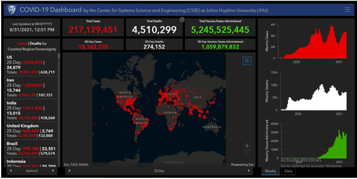
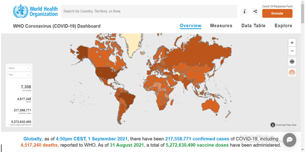

```{r setup, include=FALSE}
knitr::opts_chunk$set(echo = FALSE)
```


**Thiyanga S. Talagala**^[Corresponding author, email: ttalagala@gmail.com]

Department of Statistics, Faculty of Applied Sciences 

University of Sri Jayewardenepura, Sri Lanka, CO10230

\hspace{3cm}


**Randi Shashikala**

Department of Statistics, Faculty of Applied Sciences

University of Sri Jayewardenepura, Sri Lanka, CO 10230


**Abstract**

As of September 20th, 2021, 221 countries and territories are infected by the COVID-19 worldwide pandemic. Dashboards are the most often used visualization method for visualizing COVID-19 data and informing the public. The main objective of this study is to identify different features, visualization methods & improvements that should be occurred by exploring the existing dashboards and to develop a dashbored to visualize COVID-19 outbreak in Sri Lanka. We explored 15 different dashboards. The most commonly used visualization methods in dashboard development are bar charts, line charts, and interactive maps. Dashboards that fit on a single screen are preferable than others.


**Keywords:** Visualization, multiple time series, heatmap, COVID-19 vaccine, flexdashboard

# Introduction

The COVID-19 pandemic is a global coronavirus illness outbreak that began in 2019 and is being caused by the Severe Acute Respiratory Syndrome Coronavirus 2 (SARS-CoV-2) virus. In December 2019, the first COVID-19-infected patient was discovered in Wuhan, China. According to Worldmeter data, there were 229835231 confirmed cases, 206515718 recovered cases, 18605877 active cases, and 4713636 deaths worldwide as of September 20, 2021. Currently, 99.5 percent of active patients are in a mild state, while 0.5 percent are in a critical state.

Dashboards are one of the greatest visual interpretation methods for tracking the COVID-19 pandemic's spread and communication. There are a plethora of COVID-19 visualization dashboards that have been designed to visualize the pandemic's global and local status. Different software can be used to generate dashboards. We explored 15 dashboards designed to visualize COVID-19 data in the global and country levels. First, dashboards were compared to identify the various features, visualization approaches, and enhancements that should be implemented. Next, we developed an interactive dashboard to visualized COVID-19 outbreak in Sri Lanka.

# Literature Review

Initially 15 dashboards were compared  to determine which data types are most frequently shown in dashboards. The 15 dashboards we used in the study are listed below (Table 1).

**Table 01: Labeled of the Dashboards**

|No |Name of the Dashboard|Reference|
|:--:|:-------------------|------|
|1 | COVID-19 dashboard created by the John Hopkins University Center for Systems Science & Engineering (JHU CSSE) |@jh|
|2 | WHO  COVID-19 Dashboard |@who|
|3 | COVID-19 surveillance dashboard created by the University of Virginia |@nssac|
|4 | Corona cases (COVID-19) per municipality in Belgium dashboard |@belgium|
|5 | COVID-19 dashboard for England created by NHS providers |@nhs|
|6 | NZ COVID-19 Dashboard |@nz|
|7 | Pakistan’s official COVID-19 dashboard |@pakistan|
|8 | COVID-19 Canada live dashboard |@canada|
|9 | India (COVID-19) Dashboard | @indiadash |
|10 | Italy COVID-19 dashboard |@italy|
|11 | Jamaica COVID-19 Dashboard |@jamaica|
|12 | GCI COVID-19 dashboard for Russia |@russia|
|13 | COVID-19 live situation analysis dashboard of Sri Lanka |@sl|
|14 | COVID 19 ZA South Africa Dashboard |@za|
|15 | COVID-19 dashboard for Germany |@rki|


### Summary of data representation on dashboards

**Table 02: Summary of data represent in the dashboards**


| Name of the Dashboard| Location (Represented) | Confirmed Cases| Recovered Cases| Deaths | Vaccination Details| Tests| Global Comparison|
|:------------:|:------------|:------------:|:------------:|:------------:| :------------:|:------------:|:------------:|  
| 1                     | Global | \checkmark        |   \checkmark       |\checkmark  | \checkmark             |   | \checkmark 
| 2                     | Global |\checkmark        |   \checkmark        |\checkmark  | \checkmark              |   | \checkmark 
| 3                     | Global  |   \checkmark        |\checkmark  | \checkmark              |   | \checkmark 
| 4                     | Belgium |\checkmark          |   \checkmark        |\checkmark  |                     |  |  
| 5                     | England |\checkmark          | \checkmark        |\checkmark  | \checkmark              |  |
| 6                     | New Zealand | \checkmark          |   \checkmark       |\checkmark |                     |  |\checkmark 
| 7                     | Pakistan | \checkmark         |  \checkmark        |\checkmark  |                     |\checkmark  |
| 8                     | Canada | \checkmark          |  \checkmark        |\checkmark  |                     |  | |
| 9                     | India | \checkmark         |   \checkmark        |\checkmark  | \checkmark              | | \checkmark 
| 10                    | Italy | \checkmark         |   \checkmark        |\checkmark  |                     |\checkmark  |
| 11                    | Jamaica | \checkmark        |   \checkmark        |\checkmark  | \checkmark            | | 
| 12                    | Russia |\checkmark         |  \checkmark       |\checkmark  |                     | | 
| 13                    | Sri Lanka |\checkmark          |   \checkmark       |\checkmark  |                     | \checkmark  | \checkmark 
| 14                    | South Africa |\checkmark        |   \checkmark        |\checkmark  | \checkmark              | \checkmark  |
| 15                    | German |\checkmark          |  \checkmark        |\checkmark  | \checkmark              | |


As shown in table 02 all dashboards which are considered in this paper represent the data related to COVID-19 confirmed cases, recovered cases & deaths. There have been contained vaccination details, 8 dashboards out of 15 dashboards. In almost each & every dashboard, value boxes have been used to represent these total figures. Bar charts & line charts (trend lines) are most frequently used to visualize these data (confirmed cases, recovered cases, deaths & vaccination details) with respect to time. A Majority of dashboards presented data by daily or weekly. The mapping is used to track the spatial distribution of COVID-19 cases by country/ provincial/ regional etc. When visualizing the data by map color code system & circles with respect to the size of the cases have been used to visualize the variation in size. The considerable number of dashboards has been used doughnut shape pie charts to represent total COVID-19 confirmed cases, recovered cases, active cases & deaths as a percentage. Also, region, gender, age group & ethnicity can be identified as common breakdowns of COVID-19 cases. In some dashboard has been added data tables for representing cases distribution by province/region.  Only very few dashboards have been visualized in COVID-19 test details. Only 6 dashboards have been compared to global situations. In addition, fatality rate, incidence rate, ICU beds, stage of the patients & hospitalize details have been contained in the several dashboards. These are the most common data types that have been contained in the dashboards. The main tools that have been used for different purpose can be shown in the following table.\hfill\break


**Table 03: Summary of tools which are used for different purpose**


|Purpose | Bar chart | Line chart | Pie chart | Dot plot| Heat map| Mapping| Data table|
|:-------|:---------:|:----------:|:---------:|:--------:|:--------:|:-------:|:-------:|
| COVID-19 confirmed 
cases | \checkmark  | \checkmark  |  | \checkmark  |  | \checkmark  |\checkmark 
| COVID-19 deaths | \checkmark  | \checkmark  |  |  | | \checkmark  | \checkmark 
| COVID-19 recovered 
cases | \checkmark  | \checkmark  | | | | \checkmark  | \checkmark
| COVID-19 vaccination | | \checkmark  |  | | | \checkmark  | \checkmark
| COVID-19 test 
conducted | \checkmark  | \checkmark  | | | | |
| Clinical status | \checkmark  | | | | | | 
| Cases distribution by 
age  | \checkmark  | | \checkmark  | | |  |
| Cases distribution by 
gender | \checkmark  | | | | | |
| Cases distribution by area
(Province/state/region) | \checkmark  | \checkmark  |  | | \checkmark  | \checkmark  | \checkmark
| To compare the cases | | |  \checkmark  | | |  |  \checkmark 
| Global comparison |  \checkmark  |  \checkmark  | | | |  \checkmark  | \checkmark 


### 2.2 Comparison of Dashboards

Before developing a dashboard, it is necessary to think about which visualization tools & features that should be contained in the dashboards. What are the most suitable plots, how many panels in the dashboard, what data should be included, how to fit dashboard on a screen, colors & is it real time updated or not are the common things that should be considered before develop the dashboards. In table 02 has been compared these visualization tools & features under the following categories. 

  * Number of panels - How many panels which are included in the dashboard.
  * Visualization tools – what are the graphical representations of data which are contained in the dashboards. 
  * Fitted on a single screen – whether the dashboard fits on a single screen or not (users can see the whole dashboard on a single screen without adjusting through grid overlay or not).
  * Color theme – is there a unique color used for one data type in the whole dashboard (i.e.: one color scale for one data type everywhere on the dashboard). 
  * Dark background – background color of the dashboard is dark or light.
  * Data available – whether users can be downloaded/available the data set which has been visualized on the dashboard. 
  * Real time updated – whether the dashboard is updated daily/ specific time (live dashboard) or not.


**Table 04: Comparison of visualization tools & features of dashboard** 


| Name of the Dashboard | Number of panels|  Visualization tools | Fitted on a single screen | Color theme | Dark background | Data available | Real time updated|
|:-------: |:-------: |:-------:  |:-------:|:-------:   |:-------:  |:-------:   |:-------:  |
| 1                |  1   | Bar chart\hfill\break  Interactive map\hfill\break |\checkmark         |   \checkmark      |\checkmark | \checkmark   | \checkmark
| 2             | 4   | Line chart\hfill\break  Interactive map\hfill\break  Data table\hfill\break|         |   \checkmark       |    |     \checkmark        |\checkmark 
| 3         |2         |Line chart\hfill\break  Bar chart\hfill\break Interactive map\hfill\break Data table\hfill\break  | \checkmark         |   \checkmark       |\checkmark | \checkmark             |\checkmark
|4 | 1|Line chart\hfill\break Bar chart\hfill\break  Pie chart\hfill\break Interactive map\hfill\break |\checkmark |   | \checkmark |\checkmark| \checkmark
|5 | 1| Line chart\hfill\break Bar chart\hfill\break Data table\hfill\break |   | \checkmark |   | \checkmark | \checkmark
|6 | 5| Line chart\hfill\break Bar chart\hfill\break Dot plot\hfill\break  Interactive country map\hfill\break |   |   |   | \checkmark | \checkmark
|7 | 1|  Line chart\hfill\break Bar chart\hfill\break  Country map\hfill\break Data table\hfill\break |    | \checkmark  |    |    | \checkmark
|8 | 3| Line chart\hfill\break Bar chart\hfill\break Data table\hfill\break Interactive map\hfill\break |    |    | \checkmark |   | \checkmark
|9 |3 | Line chart\hfill\break Bar chart\hfill\break Doughnut shape pie chart\hfill\break Data table\hfill\break Interactive country map\hfill\break |  | \checkmark |  | \checkmark | \checkmark 
|10  | 2| Bar chart\hfill\break Doughnut shape pie chart\hfill\break Heat map\hfill\break Interactive country map\hfill\break |   |   |    |    | \checkmark
|11 | 1| Line chart\hfill\break Bar chart\hfill\break Doughnut shape pie chart\hfill\break Data table\hfill\break Interactive country map\hfill\break |  | \checkmark |   |   | \checkmark
|12 | 1| Line chart\hfill\break Bar chart\hfill\break  Interactive map\hfill\break |   | \checkmark | \checkmark |   | \checkmark
|13 | 1| Line chart\hfill\break Bar chart\hfill\break Doughnut shape pie chart\hfill\break |  |\checkmark |   |   | \checkmark
|14| 2| Line chart\hfill\break Bar chart\hfill\break  Interactive Country map\hfill\break |  | \checkmark|   | \checkmark | \checkmark
|15 | 1| Line chart\hfill\break Bar chart\hfill\break  Data table\hfill\break Interactive map\hfill\break | \checkmark| \checkmark| \checkmark|  | \checkmark


  


As shown in table 04 almost each & every dashboard, line charts & bar charts have been used to visualize the data. Heat map & dot plot has been used only one dashboard. Only four dashboards have been fitted with a single screen. The majority of dashboards have used color theme on the whole dashboard. That is, dashboards have been applied different colors for different type of data (i.e. One specific color for confirmed cases, another color for deaths, etc.) in the whole dashboard. The data set & related links have available on some dashboards & users can download these data sets. There are 6 dashboards with dark background while others have been used light background. Last updated time & date of the latest available data  has been reported at the top or bottom of the first panel in the dashboard. Like, half of dashboards included all data in one panel.    


# Methodology

\newpage


# Results


The "Sri Lanka COVID-19 Dashboard" provides an overview of the COVID-19 pandemic for Sri Lanka. This dashboard has eight panels as follows.

**Table 05: Description of the panels**

| **Name of the Panel**|**Description of the Panel**| 
|:------|:----------------------------------------------|
|Overview          |Total count of COVID-19 confirmed, recovered, deaths, active cases & total vaccine doses administered.\hfill\break Provide an overview of daily COVID-19 confirmed, recovered & deaths by plots.\hfill\break|
|Cases by Wave| There are three tabs in this panel.\hfill\break  * Total COVID-19 confirmed cases - Cumulative count of COVID-19 confirmed cases with specific dates\hfill\break * COVID-19 Cases Distribution by Wave - Daily confirmed cases by wave\hfill\break * COVID-19 Deaths Distribution by Wave - Daily deaths by wave\hfill\break| 
|COVID-19 Patients Distribution | Provide an overview of confirmed cases district wise distribution. There are four tabs in this panel.\hfill\break * Total COVID-19 Patients Distribution in Sri Lanka - Total confirmed counts for each district is represented by tree map\hfill\break * Country Map - Total confirmed cases in each district represented by Sri Lanka country map\hfill\break * Distribution of Daily COVID-19 Patients for Last 30 Days - Visualize the daily confirmed cases distribution by districts in last 30 days\hfill\break * By Applying Min-Max Transformation - Visualize the details in the third tab by applying min-max transformation for each district\hfill\break|
|Vaccination Details | Provide an overview of COVID-19 vaccination in Sri Lanka. There are two tabs.\hfill\break * Total Vaccine Doses - Visualize the administered vaccine doses as first dose only & fully vaccinated\hfill\break * Total Administered Doses by Vaccine Name - Visualize the vaccination by vaccine names\hfill\break|
| Top 10 Countries| In this panel, compare the Sri Lanka confirmed & deaths with top 10 countries in the world (top 10 countries - The countries which have been reported highest number of confirmed cases as 31st of August 2021).\hfill\break There are two tabs.\hfill\break * Comparison of Cumulative Cases in Sri Lanka with Top 10 Countries - Compare the confirmed and deaths in Sri Lanka with top 10 countries by cumulative time series plots\hfill\break * Comparison of Log of Cumulative Cases in Sri Lanka with Top 10 Countries -  Compare the confirmed and deaths in Sri Lanka with top 10 countries by log cumulative time series plots\hfill\break (The data has been pulled from WHO)\hfill\break|
|Global Comparison | Compare the total confirmed & deaths in Sri lanka with top 10 countries in Global & Asia. There are two tabs.\hfill\break * Comparison of the sri Lanka with Top 10 Countries Reporting the Most COVID-19 Cases in the World - Compare the total confirmed & deaths in Sri Lanka with top 10 countries in the world & compare the case fatality ratios\hfill\break * Comparison of the sri Lanka with Top 10 Countries Reporting the Most COVID-19 Cases in the Asia - Compare the total confirmed & deaths in Sri Lanka with top 10 countries in the Asia & compare the case fatality ratios\hfill\break|
|Global Map| Visualize the distribution of confirmed, recovered & deaths in the world by world map.\hfill\break|
|About | This panel contains the details about the dashboard.|


# Discussion and Further research


Bar charts & line charts are the most frequently used tools for the visualization of total cases, daily cases & comparisons with respect to time. Some dashboards contained doughnut shape pie charts to summarize the total figures. In almost each and every dashboard, value boxes have been used to represent total figures. Some dashboards contained interactive maps & data tables to visualize the distribution of cases by country, province, region or state. All dashboards are daily updating real time dashboards. Gender, age groups and ethnicity can be identified as common breakdowns. The data sets & related links are available on most of the dashboards & can be downloaded. It can be seen that it is very easy, clear and user friendly to identify confirmed, recovered and deceased cases in dashboards which include one color theme for the whole dashboard. Dashboards with the dark background are more comfortable to the eyes than dashboards with light background & light colors. Also, it is better if the dashboard can be fitted on a single screen rather than adjusting through a grid overlay.


# Appendix: Overview of reviewed dashboard

Real time updated COVID-19 dashboard created by the John Hopkins University Center for Systems Science & Engineering (JHU CSSE) has included total confirmed cases & total deaths by country, province/region/state (not for all countries)[6]. Weekly & daily global confirmed cases, deaths & vaccine doses have been visualized using bar plots related to the date in the side panels. Also, an interactive world map has included in the dashboard to represent total confirmed cases, incidence rate, fatality ratio & vaccine doses administered by country & state of US. All the links related to the data sets has been included in the dashboard. In this dashboard red, white, green colors has been used to indicate confirmed cases, deaths & vaccine doses respectively. The dashboard has fitted on a single screen.

```{r, fig.cap="Johns Hopkins University COVID-19 Dashboard"}

```


Live updated “WHO COVID-19 dashboard” contained four panels. The interactive world
map in the dashboard has visualized the distribution of COVID-19 confirmed cases, deaths &
vaccination by country [15]. Line chart & bar charts have been used as visualization plots. Blue, red, green colors have been used to represent confirmed cases, deaths & vaccination respectively. The links related to the underlying data was available in the dashboard. The dashboard was not fitted on a single screen.

```{r, fig.cap="WHO COVID-19 Dashboard"}

```

The “COVID-19 surveillance dashboard” created by the University of Virginia in
collaboration with Bio complexity Institute has included interactive world map with a time slide to visualize the confirmed cases, recovered cases, deaths, active cases & vaccine details [7]. Line charts, bar charts & data tables have been visualized in the dashboard. Red, blue, green & yellow colors have been used to identify confirmed, deceased, recovered & active cases respectively. The data behind the dashboard also available on the dashboard & can be downloaded. The dashboard has fitted on a single screen.

```{r, fig.cap="COVID-19 Surveillance Dashboard"}
knitr::include_graphics("Images/3.PNG")
```


Corona cases (COVID-19) per municipality in Belgium dashboard has included interactive
map for distribution of total confirmed cases per municipality, bar chart for number of cases per province, line charts for number of cases per day by region & municipality, dodge bar chart for deaths per region, per age & pie chart for deaths per age as visualization methods[3]. Also it included several value boxes for total cases, total deaths & hospital situations. There was no specific color theme used in this dashboard. This dashboard also fitted on a single screen.

```{r, fig.cap="Corona cases per Municipality in Belgium Dashboard"}
knitr::include_graphics("Images/4.PNG")
```


The COVID-19 dashboard for England created by NHS providers included daily totals, daily changes & weekly changes in new cases, hospital admission, patients in hospital, and patients
in ICU beds, deaths & vaccinations in England as counts [2]. Bar plots for daily new cases, hospital admissions & deaths for last 30 days have been added in this dashboard. Also it has included data table for total count, daily changes (as increase or decrease), weekly changes (as increase or decrease) of new cases & hospital admission by region. It can be seen that, three different colors have been used in bar plot as orange for new cases, green for hospital admissions & red for deaths. These plots were not interactive plots & there was only one panel. The dashboard was not fitted on a single screen.

```{r, fig.cap="COVID-19 dashboard for England"}
knitr::include_graphics("Images/5.PNG")
```


The Environmental Science and Research Institute COVID-19 dashboard for New Zealand (was developed & is maintained in collaboration with Epi-interactive Ltd) contained five panels
as overview, outbreak, source, international & ESR reports [10]. In this real time updated dashboard, they have included value boxes for total confirmed cases, recovered cases, deaths & interactive map has been added for distribution of confirmed & probable cases as incidence & count. Also they have included bar charts for confirmed cases distribution by gender, age group, & line charts for confirmed & deaths as daily & cumulative. The dashboard has not fitted on a single screen.

```{r, fig.cap="New Zealand COVID-19 Dashboard"}
knitr::include_graphics("Images/6.PNG")
```


Pakistan’s official COVID-19 dashboard is a real time updated dashboard with one panel. This dashboard contains value boxes for total confirmed cases, active cases, deaths, recovered
cases by country. Province wise cases have been represented by map & data table [11]. Line charts & bar charts have been added to visualize the distribution of cases related to time & province. In the value boxes blue, orange, pink & green colors have been applied for confirmed cases, active cases, deaths & recoveries respectively, but there was no specific color theme used when plotting the graphs. The dashboard cannot be seen on a single screen without grid overlay.

```{r, fig.cap="COVID-19 Dashboard for Pakistan"}
knitr::include_graphics("Images/7.PNG")
```


COVID-19 Canada live dashboard has been developed with three panels for provincial data, hospital resources & projections [14]. This dashboard contained interactive map for represented total reported cases & deaths by province. Data tables, line charts, bar charts were the most frequently used visualization types of this dashboard. More details were presented on this dashboard by province like ventilator counts, hospital beds per 100 residents, resource capacity based on critical case rate, effect of social distance, forecast of deaths & cases. There was no specific color theme applied for plotting the graphs. The dashboard also was not fitted on a single screen.

```{r, fig.cap="COVID-19 in Canada dashboard"}
knitr::include_graphics("Images/8.PNG")
```


“Zoho analytics COVID-19 live dashboard” for India contained three panels as insight by state, trend analysis & vaccination [1]. Interactive country map has been used to visualize the distribution of confirmed cases, active cases, deaths, recovered cases & vaccination by states in India. Line charts, bar charts & doughnut shape pie charts have been used as other visualization tools. Also this dashboard contained data table for overview of COVID-19 in India. This dashboard also was not fitted on a single screen.

```{r, fig.cap="India COVID-19 Dashboard"}
knitr::include_graphics("Images/9.PNG")
```


Italy COVID-19 dashboard created by the COVID-19 task force of the department of infection diseases and the IT service Istituto Superiore Sanita, contained interactive map, bar charts, doughnut shape pie charts & heat maps as visualization tools [4]. It provides data related to COVID-19 cases, cases distribution by age, clinical status, and weekly number of cases notified in Italy by region/province. This dashboard also was not fitted on a single screen.

```{r, fig.cap="Italy COVID-19 Dashboard"}
knitr::include_graphics("Images/10.PNG")
```

Live COVID-19 dashboard developed & contributed by an amber innovations for the government of Jamaica has added interactive country map & data table to represent the COVID-
19 cases by parish [9]. Line charts & bar charts have been added to the dashboard for cumulative & daily COVID-19 cases. Yellow, green & red colors have been used to represent confirmed, recovered & deaths respectively. Doughnut shape pie chart has been added to represent the distribution of recovered, confirmed & deaths by age group. This dashboard was not fitted on a single screen.

```{r, fig.cap="Jamaica COVID-19 Dashboard"}
knitr::include_graphics("Images/11.PNG")
```


The GCI COVID-19 dashboard for Russia includes an interactive map, bar charts & line charts to visualize the COVID-19 data [13]. Yellow, green, red & blue colors have been added to
identify the confirmed, recovered, deaths & active case respectively in plotting the charts.

```{r, fig.cap="GCI COVID-19 Dashboard for Russia"}
knitr::include_graphics("Images/12.PNG")
```


COVID-19 live situation analysis dashboard of Sri Lanka contains total & daily figures in Sri Lanka as counts [5]. Total cases & active cases have been visualized by using a line chart. Bar charts have been used to summarize the daily confirmed cases and recovered cases. As well fatality rate, recovery rate & daily investigations using PCR tests & rapid antigen tests have been compared by using the bar charts. Doughnut shape pie chart has been used to summarize the total cases. Blue, green & red colors have been applied to active, recovered & deaths respectively. This dashboard was also not fitted on a single screen.

```{r, fig.cap="COVID-19 Live Situational Analysis Dashboard of Sri Lanka"}
knitr::include_graphics("Images/13.PNG")
```


COVID-19 live situation analysis dashboard of Sri Lanka contains total & daily figures in Sri Lanka as counts [5]. Total cases & active cases have been visualized by using a line chart. Bar charts have been used to summarize the daily confirmed cases and recovered cases. As well fatality rate, recovery rate & daily investigations using PCR tests & rapid antigen tests have been compared by using the bar charts. Doughnut shape pie chart has been used to summarize the total cases. Blue, green & red colors have been applied to active, recovered & deaths respectively. This dashboard was also not fitted on a single screen.

```{r, fig.cap="COVID 19 ZA South Africa Dashboard"}
knitr::include_graphics("Images/14.PNG")
```


Robert Koch-Institute COVID-19 dashboard for German contains interactive map, line charts & bar charts as visualization tools of COVID-19 data [12]. The dashboard has been fitted
on a single screen. This dashboard format is similar to the John Hopkins dashboard.

```{r, fig.cap="Robert Koch-Institute COVID-19 dashboard for German"}
knitr::include_graphics("Images/15.PNG")
```

# References


