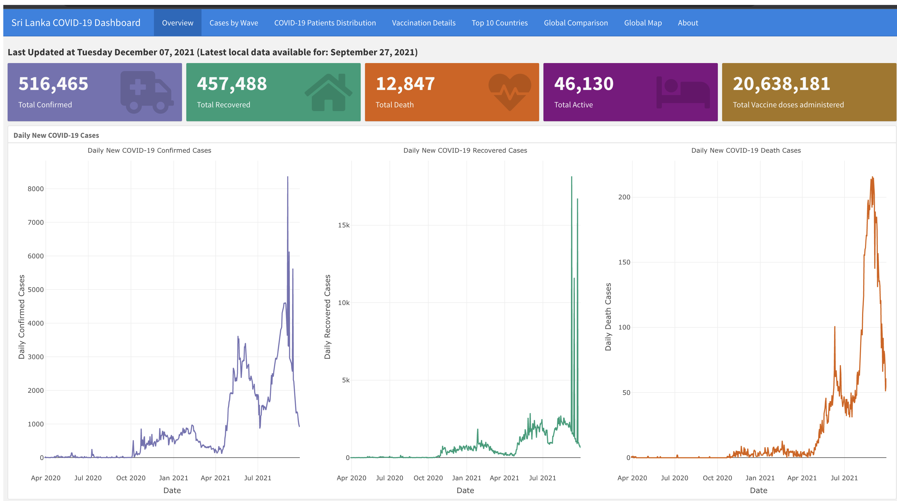
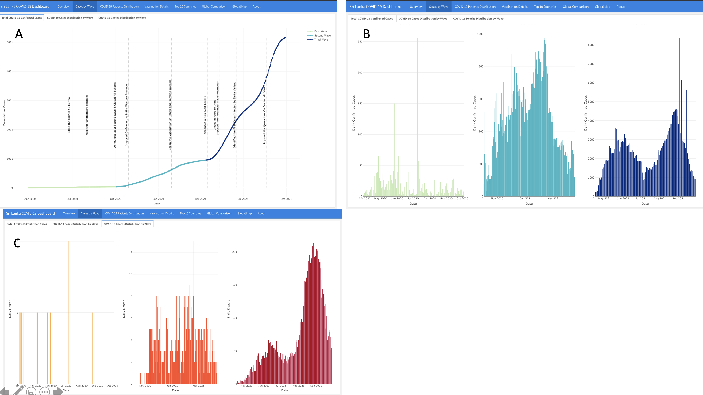
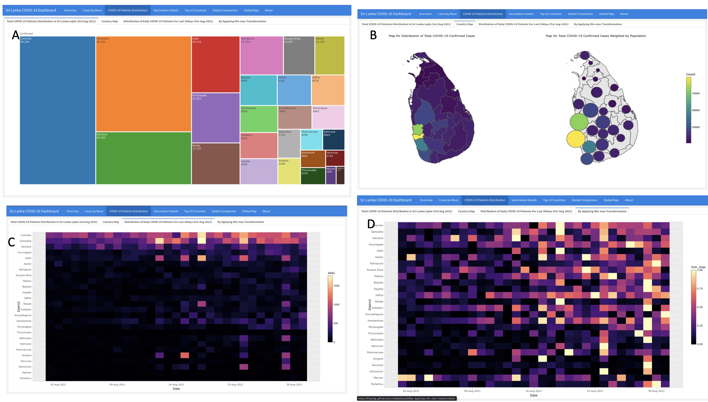
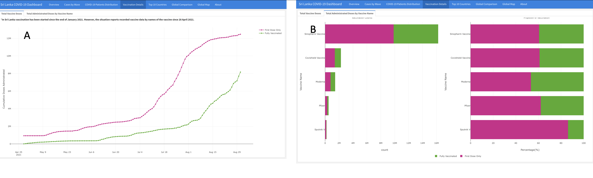
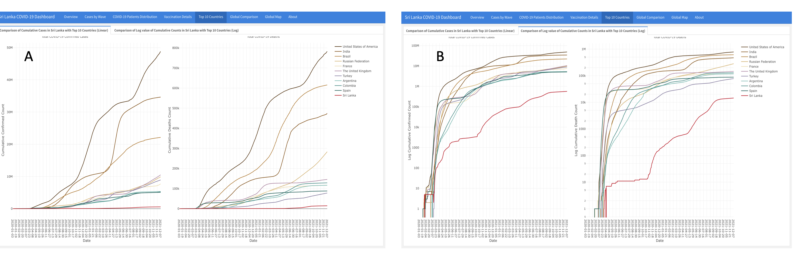
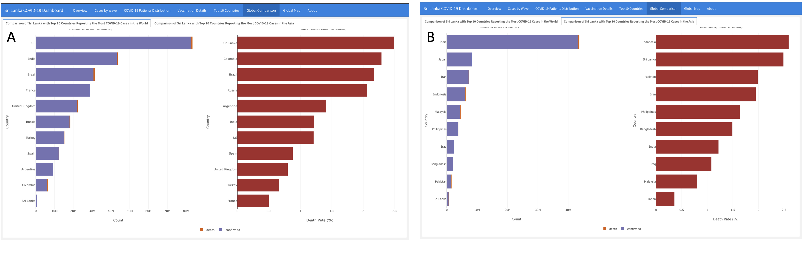
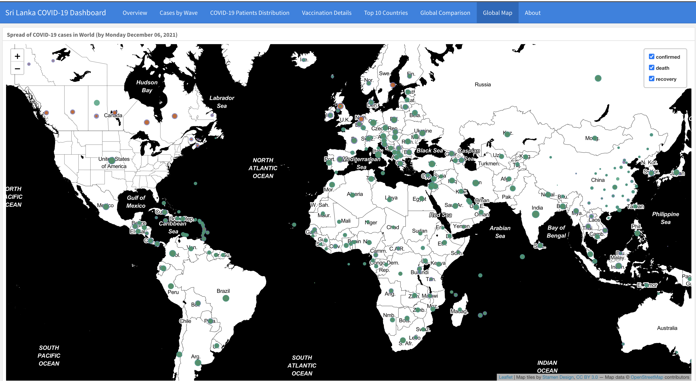
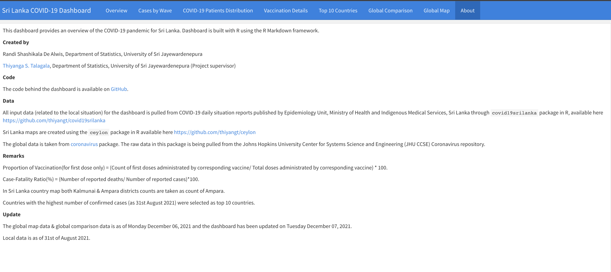

```{r setup, include=FALSE, message=FALSE, warning=FALSE}
knitr::opts_chunk$set(echo = FALSE, message = FALSE, warning = FALSE)
library(ceylon)
library(tidyverse)
library(sf)
#install.packages("cartogram")
library(cartogram)
```


**Thiyanga S. Talagala**^[Corresponding author, email: ttalagala@gmail.com]

Department of Statistics, Faculty of Applied Sciences 

University of Sri Jayewardenepura, Sri Lanka, CO 10230

\hspace{3cm}


**Randi Shashikala**

Department of Statistics, Faculty of Applied Sciences

University of Sri Jayewardenepura, Sri Lanka, CO 10230

\hspace{3cm}

**Abstract**

As of September 20th, 2021, 221 countries and territories are infected by the COVID-19 worldwide pandemic. Dashboards are the most often used visualization method for visualizing COVID-19 data and informing the public.  We explored 15 different dashboards. 


**Keywords:** Visualization, multiple time series, heatmap, COVID-19 vaccine, flexdashboard

# Introduction

COVID-19 has expanded over the globe, having a significant impact on our daily lives and work. Early responses and timely decisions and actions are critical to saving communities and economies worldwide. Data is essential in order to make effective decisions. Data-driven information guides the decision-making process and also evaluates the effectiveness of strategies taken.

Massive amounts of data are being generated in the response to the COVID-19 pandemic. Given this available data, it is critical to create tools for exploratory analysis for policymakers, health officials, and the general public. Dashboards are one of the greatest visual interpretation methods for tracking the COVID-19 pandemic's spread and vaccine administration. Dashboards allow users to quickly interact with a combination of exploratory visualizations and gain a quick overview of the data. This paper describes the development and implementation of a dashboard for the COVID-19 outbreak and vaccine administration data in Sri Lanka.

There are a plethora of COVID-19 visualization dashboards that have been designed to visualize the pandemic's global and local status. Different software can be used to generate dashboards. We explored 15 dashboards designed to visualize COVID-19 data at the global and country levels. First, dashboards were compared to identify the various features, visualization approaches, and enhancements that should be implemented. Next, we developed an interactive dashboard to visualize the COVID-19 outbreak and vaccination information in Sri Lanka. This dashboard provides front-line health officers a situational awareness of the spread of COVID-19 and the status of the vaccination program.

The rest of the paper is organized as follows: [Section 2](#litreview) of dashboards created using data related to the COVID-19 pandemic. [Section 3](#methods) presents the methodology and basic design concept; [Section 4](#results) presents the results; and [Section 5](# conclusion) concludes.

# Literature Review {#litreview}

Dashboards are one of the best visual interpretation methods for tracking the spread and communication of the COVID-19 pandemic. The 15 dashboards we used in the literature survey are listed in Table 1. We compared dashboards to identify data types, plotting techniques, colour themes, and other features such as interactivity on plots and panel numbers.


**Table 01: Labeled of the Dashboards**


|No |Name of the Dashboard|Reference|
|:--:|:-------------------|------|
|1 | COVID-19 dashboard created by the John Hopkins University Center for Systems Science & Engineering (JHU CSSE) |@jh|
|2 | WHO  COVID-19 Dashboard |@who|
|3 | COVID-19 surveillance dashboard created by the University of Virginia |@nssac|
|4 | Corona cases (COVID-19) per municipality in Belgium dashboard |@belgium|
|5 | COVID-19 dashboard for England created by NHS providers |@nhs|
|6 | NZ COVID-19 Dashboard |@nz|
|7 | Pakistan’s official COVID-19 dashboard |@pakistan|
|8 | COVID-19 Canada live dashboard |@canada|
|9 | India (COVID-19) Dashboard | @indiadash |
|10 | Italy COVID-19 dashboard |@italy|
|11 | Jamaica COVID-19 Dashboard |@jamaica|
|12 | GCI COVID-19 dashboard for Russia |@russia|
|13 | COVID-19 live situation analysis dashboard of Sri Lanka |@sl|
|14 | COVID 19 ZA South Africa Dashboard |@za|
|15 | COVID-19 dashboard for Germany |@rki|


  
  
Table 02 summarizes the data types that are most frequently shown in dashboards. As shown in Table 02, all dashboards which are considered in this paper represent the data related to COVID-19 confirmed cases, recovered cases, and deaths. There were 8 dashboards out of 15 dashboards that contained vaccination details.

**Table 02: Summary of data represent in the dashboards**


| Name of the Dashboard| Location (Represented) | Confirmed Cases| Recovered Cases| Deaths | Vaccination Details| Tests| Global Comparison|
|:------------:|:------------|:------------:|:------------:|:------------:| :------------:|:------------:|:------------:|  
| 1                     | Global | \checkmark        |   \checkmark       |\checkmark  | \checkmark             |   | \checkmark 
| 2                     | Global |\checkmark        |   \checkmark        |\checkmark  | \checkmark              |   | \checkmark 
| 3                     | Global  |   \checkmark        |\checkmark  | \checkmark              |   | \checkmark 
| 4                     | Belgium |\checkmark          |   \checkmark        |\checkmark  |                     |  |  
| 5                     | England |\checkmark          | \checkmark        |\checkmark  | \checkmark              |  |
| 6                     | New Zealand | \checkmark          |   \checkmark       |\checkmark |                     |  |\checkmark 
| 7                     | Pakistan | \checkmark         |  \checkmark        |\checkmark  |                     |\checkmark  |
| 8                     | Canada | \checkmark          |  \checkmark        |\checkmark  |                     |  | |
| 9                     | India | \checkmark         |   \checkmark        |\checkmark  | \checkmark              | | \checkmark 
| 10                    | Italy | \checkmark         |   \checkmark        |\checkmark  |                     |\checkmark  |
| 11                    | Jamaica | \checkmark        |   \checkmark        |\checkmark  | \checkmark            | | 
| 12                    | Russia |\checkmark         |  \checkmark       |\checkmark  |                     | | 
| 13                    | Sri Lanka |\checkmark          |   \checkmark       |\checkmark  |                     | \checkmark  | \checkmark 
| 14                    | South Africa |\checkmark        |   \checkmark        |\checkmark  | \checkmark              | \checkmark  |
| 15                    | German |\checkmark          |  \checkmark        |\checkmark  | \checkmark              | |

Table 03 highlights the dashboard visualization techniques. Value boxes have been utilized to display total figures on practically every dashboard. The most common ways of visualizing confirmed cases, recovered cases, deaths, and immunization details are bar charts and line charts (trend lines). The majority of dashboards displayed data on a daily or weekly basis. The spatial distribution of COVID-19 cases by country, province, regional, and other factors is tracked using choropleth maps. When visualizing the data by the map color code system, circles with respect to the size of the cases have been used to visualize the variation in size. Several dashboards use doughnut-shaped pie charts to indicate total COVID-19 confirmed cases, recovered cases, active cases, and deaths as a proportion. Furthermore, region, gender, age group, and ethnicity can be identified as common breakdowns of COVID-19 cases. Data tables for representing cases' distribution by province/region have been added to some dashboards. Very few dashboards have been visualized in the COVID-19 test details. Only 6 dashboards have been compared to global situations. In addition, the fatality rate, incidence rate, ICU beds, stage of the patients, and hospitalized details have been contained in the several dashboards.\hfill\break


**Table 03: Summary of tools which are used for different purpose**


|Purpose | Bar chart | Line chart | Pie chart | Dot plot| Heat map| Mapping| Data table|
|:-------|:---------:|:----------:|:---------:|:--------:|:--------:|:-------:|:-------:|
| COVID-19 confirmed 
cases | \checkmark  | \checkmark  |  | \checkmark  |  | \checkmark  |\checkmark 
| COVID-19 deaths | \checkmark  | \checkmark  |  |  | | \checkmark  | \checkmark 
| COVID-19 recovered 
cases | \checkmark  | \checkmark  | | | | \checkmark  | \checkmark
| COVID-19 vaccination | | \checkmark  |  | | | \checkmark  | \checkmark
| COVID-19 test 
conducted | \checkmark  | \checkmark  | | | | |
| Clinical status | \checkmark  | | | | | | 
| Cases distribution by 
age  | \checkmark  | | \checkmark  | | |  |
| Cases distribution by 
gender | \checkmark  | | | | | |
| Cases distribution by area
(Province/state/region) | \checkmark  | \checkmark  |  | | \checkmark  | \checkmark  | \checkmark
| To compare the cases | | |  \checkmark  | | |  |  \checkmark 
| Global comparison |  \checkmark  |  \checkmark  | | | |  \checkmark  | \checkmark 


## Comparison of Dashboards

Before developing a dashboard, it is necessary to think about which visualization tools and features should be contained in the dashboard. What are the most suitable plots, how many panels in the dashboard, what data should be included, how to fit the dashboard on a screen, colors, and is it real time updated or not are the common things that should be considered before developing the dashboards. Table 4 summarizes information under the following categories:

  i. Number of panels - How many panels are included in the dashboard.
  ii. Visualization tools – what are the graphical representations of data. 
  iii. Fitted on a single screen – whether the dashboard fits on a single screen or not (users can see the whole dashboard on a single screen without adjusting through grid overlay or not).
  iv. Color theme – is there a unique color used for one data type in the whole dashboard (i.e.: one color scale for one data type everywhere on the dashboard). 
  v. Dark background – the background color of the dashboard is dark or light.
  vi. Data available – whether users can downloaded or whether data is available to reproduce the results. 
  vii. Real time updated – whether the dashboard is updated daily/ specific time (live dashboard) or not.


**Table 04: Comparison of visualization tools & features of dashboard** 


| Name of the Dashboard | Number of panels|  Visualization tools | Fitted on a single screen | Color theme | Dark background | Data available | Real time updated|
|:-------: |:-------: |:-------:  |:-------:|:-------:   |:-------:  |:-------:   |:-------:  |
| 1                |  1   | Bar chart\hfill\break  Interactive map\hfill\break |\checkmark         |   \checkmark      |\checkmark | \checkmark   | \checkmark
| 2             | 4   | Line chart\hfill\break  Interactive map\hfill\break  Data table\hfill\break|         |   \checkmark       |    |     \checkmark        |\checkmark 
| 3         |2         |Line chart\hfill\break  Bar chart\hfill\break Interactive map\hfill\break Data table\hfill\break  | \checkmark         |   \checkmark       |\checkmark | \checkmark             |\checkmark
|4 | 1|Line chart\hfill\break Bar chart\hfill\break  Pie chart\hfill\break Interactive map\hfill\break |\checkmark |   | \checkmark |\checkmark| \checkmark
|5 | 1| Line chart\hfill\break Bar chart\hfill\break Data table\hfill\break |   | \checkmark |   | \checkmark | \checkmark
|6 | 5| Line chart\hfill\break Bar chart\hfill\break Dot plot\hfill\break  Interactive country map\hfill\break |   |   |   | \checkmark | \checkmark
|7 | 1|  Line chart\hfill\break Bar chart\hfill\break  Country map\hfill\break Data table\hfill\break |    | \checkmark  |    |    | \checkmark
|8 | 3| Line chart\hfill\break Bar chart\hfill\break Data table\hfill\break Interactive map\hfill\break |    |    | \checkmark |   | \checkmark
|9 |3 | Line chart\hfill\break Bar chart\hfill\break Doughnut shape pie chart\hfill\break Data table\hfill\break Interactive country map\hfill\break |  | \checkmark |  | \checkmark | \checkmark 
|10  | 2| Bar chart\hfill\break Doughnut shape pie chart\hfill\break Heat map\hfill\break Interactive country map\hfill\break |   |   |    |    | \checkmark
|11 | 1| Line chart\hfill\break Bar chart\hfill\break Doughnut shape pie chart\hfill\break Data table\hfill\break Interactive country map\hfill\break |  | \checkmark |   |   | \checkmark
|12 | 1| Line chart\hfill\break Bar chart\hfill\break  Interactive map\hfill\break |   | \checkmark | \checkmark |   | \checkmark
|13 | 1| Line chart\hfill\break Bar chart\hfill\break Doughnut shape pie chart\hfill\break |  |\checkmark |   |   | \checkmark
|14| 2| Line chart\hfill\break Bar chart\hfill\break  Interactive Country map\hfill\break |  | \checkmark|   | \checkmark | \checkmark
|15 | 1| Line chart\hfill\break Bar chart\hfill\break  Data table\hfill\break Interactive map\hfill\break | \checkmark| \checkmark| \checkmark|  | \checkmark


As listed in Table 4, on almost each and every dashboard, line charts and bar charts have been used to visualize the data. The heat map and dot plot were only used on one dashboard. Only four dashboards have been fitted with a single screen. The majority of dashboards use a color theme on the whole dashboard. That is, dashboards have been applied with different colors for different types of data (i.e., one specific color for confirmed cases, another color for deaths, etc.) across the whole dashboard. The data set and related links are available on some dashboards, and users can download these data sets. There are 6 dashboards with a dark background, while others have a light background. The last updated time and date of the latest available data has been reported at the top or bottom of the first panel in the dashboard. Half of the dashboards included all the information in a single panel. 

# Methodology {#method}

## Data

We obtained data from COVID-19 situation reports published by the Epidemiology Unit, Ministry of Health Sri Lanka. The data includes the number of death cases, number of hospitalized cases, number of recovered cases, and COVID-19 vaccinated counts in Sri Lanka. The data is made available through an open-source R package covid19srilanka [@talagala]. 

## Design and development

R software was used for data cleaning and analysis. The flexdashboard [@flexdashboard] package was used to build the data visualization dashboard. The initial layout for the dashboard was prepared based on @rami. Data visualizations are generated using ggplot2 [@ggplot2] and plotly [@plotly] packages in R.  we used color-blind friendly colour palettes for the graphics. To represent qualitative data, a diverging colour palette was used, and to represent numeric variables, a sequential colour theme was used. Table 5 provides an overview of methods that have been used to visualize data.

**Table 5: Data visualization approaches used to visualize data**

| **Data**|**Type of graphics**| 
|:-------------------|:----------------|
|Daily COVID-19 confirmed          |Time series plots \hfill\break
|Daily COVID-19 recovered cases by time         |Time series plots \hfill\break
|Daily COVID-19 death cases by time         |Time series plots \hfill\break
|Total COVID-19 confirmed cases by time and wave         |Time series plots annotated with vertical lines to denote significant milestones \hfill\break
|Total COVID-19 death cases by time and wave         | Histogram \hfill\break
|Distribution of COVID-19 patients by districts        | Tree map, Choropleth maps, Dorling Cartogram, heatmaps \hfill\break
|Total vaccination by first dose and second dose        | Time series plot \hfill\break
|Total administrated does by vaccine name       | Stacked bar chart \hfill\break
|Total administrated does by vaccine name       | Stacked bar chart \hfill\break
|Total administrated does by vaccine name       | Stacked bar chart \hfill\break
|Comparison of cases with in Sri Lanka with Top 10 countries       | Cummulative cases by time, Log of cummulative cases by time, stacked bar chart \hfill\break
|Spread of COVID-19 around the world      | Choropleth maps \hfill\break


We now describe the novel visualization approaches we included in out dashboard. To effectively distribute the vaccine and to support situational awareness and inform policy makers decision making it is important to know the district-wise spread of COVID-19 cases.  We have daily COVID-19 data related to confirmed cases in all 25 districts in Sri Lanka. This structure generates a multiple time series collection. Visualizing these time series data is useful to identify similarities and dissimilarities between districts and their general trends. There are two approaches to visualizing these time series: (i) drawing individual time series plots for each district (as shown in Figure 2), and (ii) simultaneously plots all time series on a single panel (as shown in Figure 3). Plotting all time series simultaneously is also not possible due to overlapping time series and scale differences. Plotting separate panels for each district is not effective. The reason is that it is hard to compare across 25 different panels at once. In order to overcome these problems in multiple time series visualization,  we use heat maps ((@peng2008method)) to visualize global and local similarities and dissimilarities across districts. The associated results are shown in Figure 3. Here two heatmaps are used to show the global variations (Figure 3: A) and local variation (Figure 3: B) in the time series collection. Figure 3-A cell colours represent the actual counts of the COVID-19 confirmed cases. This is useful to get an idea about the differences in absolute values. Figure 3-B cell colours represent the normalized values created applying the min-max transformation. Min-max transformation is applied to each district time series by using the corresponding district minimum and maximum value of the time series. This helps us to get an idea about patterns within districts. For example, according to Figure 3A we can see Colombo, Gampaha and Kalutara districs COVID-19 cases are significantly higher than other districts. According to Figure 3B all districts show an increasing trend pattern as the right-hand side of the cells are lighter than the left-hand side cells in the heat map. Furthermore according to Figure 3B all districts reported high number of cases on  19, 24, 29 August, 2021. Figure 3B is useful for identifying these local outlying behaviours. As shown in Figure 4, we also use Choropleth map and Dorling cartogram to visualize spatial distribution of COVID-19 cases. The vaccination information are visualize through interactive time series plots and bar charts. A screenshot of associated panels are shown in Figure 5 and Figure 6. 
 


```{r, comment=NA, echo=FALSE, message=FALSE, warning=FALSE, fig.cap="Distribution of COVID19 Cases by Districts Plotted on a Single Panel"}
library(covid19srilanka)
library(tidyverse)
library(patchwork)
data("district.wise.cases")
f1 <- ggplot(district.wise.cases, aes(
  x=Date, y=Count,  col=District)) + geom_line() + ggtitle("A") + theme(legend.position="bottom")

```

```{r, comment=NA, echo=FALSE, message=FALSE, warning=FALSE, fig.cap="Distribution of COVID19 Cases by Districts: (A) Plotted on a Single Panel, (B) Plotted on Separate Panels.", fig.height=12, fig.width=10}
library(covid19srilanka)
library(tidyverse)
data("district.wise.cases")
f2 <- ggplot(district.wise.cases, aes(
  x=Date, y=Count)) + geom_line() + 
  facet_wrap(vars(District), scale="free", ncol=5) + ggtitle("B")
f1/f2
```


```{r heat, echo=FALSE, comment=NA, message=FALSE, warning=FALSE}
library(viridis)
library(patchwork)
# Get District wise data 
District_Covid <- district.wise.cases
District_Covid <-District_Covid[order(as.Date(District_Covid$Date, format="%Y-%m-%d")), ]

# Get total count for each district
Last_day <- District_Covid %>%
  filter(Date == max(District_Covid$Date))


Covid <- Last_day %>%
  mutate(District = case_when(
    District == "Kurunagala" ~ "Kurunegala",
    TRUE ~ District
  ))

Covidnew <- Covid %>%
  mutate(parents = "Confirmed")


i <- 1:length(District_Covid$District)
District_Covid$daily <- District_Covid$Count[i+26] - District_Covid$Count[i]
District_Covid$Date <- as.Date(District_Covid$Date)
District_Covid <- head(District_Covid, -26)

District_Covid_new <- District_Covid %>%
  arrange(Count) %>%
  mutate(District = fct_inorder(factor(District, ordered = TRUE)))

p1 <- ggplot(District_Covid_new, aes(Date, District)) + 
           geom_tile(aes(fill = daily))+
           scale_fill_viridis(option = "magma")+ 
           scale_x_date(date_breaks = '1 week', date_labels = "%d-%b-%Y") + ggtitle("A")
```


```{r, echo=FALSE,fig.cap="(A) Global View of Distribution of COVID19 Cases by DIstricts, (B) Local View of Distribution of COVID19 Cases by Districts", fig.width=10, fig.height=10}

cov_District <- as.data.frame(District_Covid)

District <- c(District_Covid$District[1:26])
data <- cov_District

# Apply min-max transformation for each district separately
covid <- function(data, District){
  results <- list(1:26)
  for(i in 1: length(District)){
    x <- filter(data, District == District[i])
    j <- 1:(nrow(data)/26)
    y <- x$daily
    x$min_max <-(y[j] - min(y))/(max(y) - min(y))
    results[[i]] <- x
  }
  return(results)
}

Data <- covid(data, District)
District_data <- do.call(rbind, Data)

District_Covid_new_1 <- District_data %>%
  arrange(Count) %>%
  mutate(District = fct_inorder(factor(District, ordered = TRUE)))

p2 <- ggplot(District_Covid_new_1, aes(Date, District)) + geom_tile(aes(fill = min_max)) + scale_fill_viridis(option = "magma") + scale_x_date(date_breaks = '1 week', date_labels = "%d-%b-%Y") + ggtitle("B")

p1/p2
```


```{r, comment=NA, message=FALSE, warning=FALSE, fig.cap="Spatial DIstribution of COVID1-19 Cases by Districts", fig.height=8}

Last_day <- District_Covid %>%
  filter(Date == max(District_Covid$Date))

Covid <- Last_day %>%
  mutate(District = case_when(
    District == "Kurunagala" ~ "Kurunegala",
    TRUE ~ District
  ))

Covidnew <- Covid %>%
  mutate(parents = "Confirmed")

SL <- district
SL$DISTRICT <- str_to_title(SL$DISTRICT)
colnames(SL) <- c("geometry", "District", "status", "population")

Covid_SL <- left_join(SL, Covid, by = c("District"))

Ampara <- Covid%>%
  filter(District %in% c("Kalmunai","Ampara" ))
newcount <- Ampara$Count %>%
  sum()

Covid_SL <- Covid_SL %>%
  filter(!(District == "[unknown]")) %>%
  filter(!(District == "Kalmunai")) %>%
  mutate(Count = ifelse(District == "Ampara", newcount, Count))

m1 <- ggplot(Covid_SL) + geom_sf(aes(fill = Count, text = paste('District:', District)), show.legend = TRUE) + 
  scale_fill_viridis()+
  theme(axis.text.x = element_blank(), 
        axis.text.y = element_blank(),
        axis.ticks = element_blank(),
        rect = element_blank()) + ggtitle("A: Choropleth map")

Covid_SL <- Covid_SL[-c(1), ]
dorl <- cartogram_dorling(Covid_SL, weight = "population")%>%
  st_as_sf()

m2 <- ggplot(dorl)+
  geom_sf(data = Covid_SL)+
  geom_sf(aes(fill = Count, text = paste('District:', District)))+
   scale_fill_viridis()+
  theme(axis.text.x = element_blank(), 
        axis.text.y = element_blank(),
        axis.ticks = element_blank(),
        rect = element_blank()) + ggtitle("B: Dorling cartogram")

m1|m2

```


The source code to reprouduce the results are available in a public GitHub repository and can be access online via https://github.com/thiyangt/covid19srilanka


# Results {#results}


The "Sri Lanka COVID-19 Dashboard" provides an overview of the COVID-19 pandemic and administration of vaacine information in Sri Lanka.  This dashboard has eight panels as listed in Table 6. 


**Table 6: Description of the panels**

| **Name of the Panel**|**Description of the Panel**| 
|:------|:----------------------------------------------|
|Overview          |Total count of COVID-19 confirmed, recovered, deaths, active cases & total vaccine doses administered.\hfill\break Provide an overview of daily COVID-19 confirmed, recovered & deaths by plots.\hfill\break|
|Cases by Wave| There are three tabs in this panel.\hfill\break  * Total COVID-19 confirmed cases - Cumulative count of COVID-19 confirmed cases with specific dates\hfill\break * COVID-19 Cases Distribution by Wave - Daily confirmed cases by wave\hfill\break * COVID-19 Deaths Distribution by Wave - Daily deaths by wave\hfill\break| 
|COVID-19 Patients Distribution | Provide an overview of confirmed cases district wise distribution. There are four tabs in this panel.\hfill\break * Total COVID-19 Patients Distribution in Sri Lanka - Total confirmed counts for each district is represented by tree map\hfill\break * Country Map - Total confirmed cases in each district represented by Sri Lanka country map\hfill\break * Distribution of Daily COVID-19 Patients for Last 30 Days - Visualize the daily confirmed cases distribution by districts in last 30 days\hfill\break * By Applying Min-Max Transformation - Visualize the details in the third tab by applying min-max transformation for each district\hfill\break|
|Vaccination Details | Provide an overview of COVID-19 vaccination in Sri Lanka. There are two tabs.\hfill\break * Total Vaccine Doses - Visualize the administered vaccine doses as first dose only & fully vaccinated\hfill\break * Total Administered Doses by Vaccine Name - Visualize the vaccination by vaccine names\hfill\break|
| Top 10 Countries| In this panel, compare the Sri Lanka confirmed & deaths with top 10 countries in the world (top 10 countries - The countries which have been reported highest number of confirmed cases as 31st of August 2021).\hfill\break There are two tabs.\hfill\break * Comparison of Cumulative Cases in Sri Lanka with Top 10 Countries - Compare the confirmed and deaths in Sri Lanka with top 10 countries by cumulative time series plots\hfill\break * Comparison of Log of Cumulative Cases in Sri Lanka with Top 10 Countries -  Compare the confirmed and deaths in Sri Lanka with top 10 countries by log cumulative time series plots\hfill\break (The data has been pulled from WHO)\hfill\break|
|Global Comparison | Compare the total confirmed & deaths in Sri lanka with top 10 countries in Global & Asia. There are two tabs.\hfill\break * Comparison of the sri Lanka with Top 10 Countries Reporting the Most COVID-19 Cases in the World - Compare the total confirmed & deaths in Sri Lanka with top 10 countries in the world & compare the case fatality ratios\hfill\break * Comparison of the sri Lanka with Top 10 Countries Reporting the Most COVID-19 Cases in the Asia - Compare the total confirmed & deaths in Sri Lanka with top 10 countries in the Asia & compare the case fatality ratios\hfill\break|
|Global Map| Visualize the distribution of confirmed, recovered & deaths in the world by world map.\hfill\break|
|About | This panel contains the details about the dashboard.|


```{r, echo=FALSE, fig.cap="Screeshot of Panel 1: Overview", out.width="80%", fig.align='center'}

```

```{r, echo=FALSE, fig.cap="Screeshot of Panel 2: Cases by Wave", out.width="80%", fig.align='center'}

```

```{r, echo=FALSE, fig.cap="Screeshot of Panel 3: Distribution of COVID-19 Patients", out.width="80%", fig.align='center'}

```

```{r, echo=FALSE, fig.cap="Screeshot of Panel 4: Vaccination Details", out.width="80%", fig.align='center'}

```

```{r, echo=FALSE, fig.cap="Screeshot of Panel 5: Comparison with Top 10 Countries", out.width="80%", fig.align='center'}

```

```{r, echo=FALSE, fig.cap="Screeshot of Panel 6: Global Comparison", out.width="80%", fig.align='center'}

```

```{r, echo=FALSE, fig.cap="Screeshot of Panel 7: World Map", out.width="80%", fig.align='center'}

```

```{r, echo=FALSE, fig.cap="Screeshot of Panel 8: About", out.width="80%", fig.align='center'}

```

\newpage

# Discussion and Further research {#conclusions}


Bar charts and line charts are the most frequently used tools for the visualization of total cases, daily cases and comparisons with respect to time. Some dashboards contained doughnut shape pie charts to summarize the total figures. In almost each and every dashboard, value boxes have been used to represent total figures. Some dashboards contained interactive maps & data tables to visualize the distribution of cases by country, province, region or state. All dashboards are daily updating real time dashboards. Gender, age groups and ethnicity can be identified as common breakdowns. The data sets & related links are available on most of the dashboards & can be downloaded. It can be seen that it is very easy, clear and user friendly to identify confirmed, recovered and deceased cases in dashboards which include one color theme for the whole dashboard. Dashboards with the dark background are more comfortable to the eyes than dashboards with light background & light colors. Also, it is better if the dashboard can be fitted on a single screen rather than adjusting through a grid overlay. 


# References


<div id="refs"></div>

